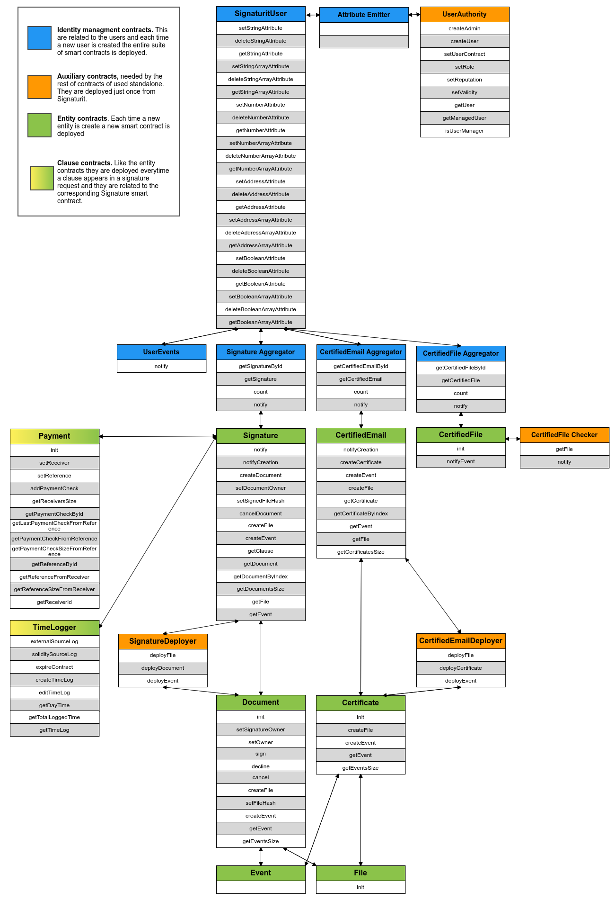

# Blockchain smart contracts

This repository contains all the Signaturit Smart Contracts used by various services. Always rely on this for the latest version of the contracts.

---

## Structure

```
build/
  /contracts         -- This contains all the compiled contracts in forms of json files
contracts/           -- Here there are all the Solidity smart contracts files
  /interfaces        -- Sub-directory that contains only the interfaces of the root contract files
  /libraries         -- Sub-directory for eventual smart contracts to serve as library/utility/tools..
migrations/          -- Scripts for truffle environment
test/                -- This is where all the smart contracts tests are located
```
## Signaturit Core - Smart Contracts

For each smart contract there is a little description and a table of yes/no values to states if a parameter's value is given in input as hashed or in its original value.

#### _SignaturitUser.sol_

This smart contract is created whenever a new user is created on Signaturit's platform. It has two public parameters: the user public key of the wallet generated outside and the public key of the deployer of the smart contract.

The remaining methods are just setters/getters/deleters of attributes among 4 different types of data (string/number/address/bool) both as singleton or arrays. 

This is useful if third parties want to set attributes to this User: the main point of a decentralized identity.

| Parameter | Type | Hashed ? |
| ------------- | ------------- | ------------- |
| rootAddress | address | no |
| ownerAddress | address | no |
| stringAttr | mapping (bytes->string) | no |
| stringArrayAttr | mapping (bytes->string[ ]) | no |
| numberAttr | mapping (bytes->uint) | no |
| numberArrayAttr |  mapping (bytes->uint[ ]) | no |
| addressAttr | mapping (bytes->address) | no |
| addressArrayAttr |  mapping (bytes->address[ ]) | no |
| boolAttr | mapping (bytes->bool) | no |
| boolArrayAttr |  mapping (bytes->bool[ ]) | no |

#### _UserAuthority.sol_

This smart contract is an aggregator of all the users. It keeps track of roles/reputation/validity of each user and build the relationships between them. It is a standalone smart contract and must exist prior to any user creation.

| Parameter | Type | Hashed ? |
| ------------- | ------------- | ------------- |
| rootAddress | address | no |
| User.contractAddress | address | no |
| User.role | uint | no |
| User.reputation | uint | no |
| User.validity | bool | no |
| User.managedUsers |  address[ ] | no |
| User.managers | mapping (address->bool) | no |

#### _AttributeManager.sol_

This is a work in progress...

#### _SignatureAggregator.sol_

This keeps track of all the signatures request that an User create and offer getters to obtain their smart contract address.
One of this is deployed for each user.

| Parameter | Type | Hashed ? |
| ------------- | ------------- | ------------- |
| signatureIds | bytes32[] | yes |
| signatures | mapping(bytes32->address | no |

#### _CertifiedFileAggregator.sol_

This keeps track of all the certified files that an User upload and offer getters to obtain their smart contract address.
One of this is deployed for each user.

| Parameter | Type | Hashed ? |
| ------------- | ------------- | ------------- |
| certifiedFilesIds | bytes32[] | yes |
| certifiedFiles | mapping(bytes32->address | no |

#### _CertifiedEmailAggregator.sol_

This keeps track of all the certified emails that an User send and offer getters to obtain their smart contract address.
One of this is deployed for each user.

| Parameter | Type | Hashed ? |
| ------------- | ------------- | ------------- |
| certifiedEmailIds | bytes32[] | yes |
| certifiedEmails | mapping(bytes32->address | no |

#### _UserEvents.sol_

This is called by the Signature, Document, CertifiedEmail, Certificate, Payment and TimeLogger smart contracts to emit events directly in blockchain of the caller transmitted event (signature created, document signed, timelog added....). Look at the definition of the smart contract to check out all the implemented events.
One of this is deployed for each user and with our SDK you can subscribe to the fired events.

| Parameter | Type | Hashed ? |
| ------------- | ------------- | ------------- |
| signaturit | address | no |
| userContract | address | no |

#### _AuditTrails.sol_

This smart contract is intended to build evidences (AuditTrail) of each signature request. It is a unique smart contract for all the users and all the signature requests they create. The contract is deployed before every other contracts and everytime a new user is created the `subscribe` function must be called in order for the contract to be able to track all the signature requests. It has no public parameters but just a function to get an audit from a `documentId` and an user or to get an event related to it.

The `subscribe` function is restricted to be called by a `onlyNotifier` modifier. This modifer checks if `tx.origin` has been set as `VALID_NOTIFIERS_KEY` in the user smart contract before the call. If in any case one of the valid notifiers account is lost, the remaining ones can call the `setNotifier` function to set someone else as valid notifier.

| Parameter | Type | Hashed ? |
| ------------- | ------------- | ------------- |
| N/A | N/A | N/A |


#### _CertifiedFileChecker.sol_

This smart contract is an aggregator of all the certified files uploaded to the Signaturit's platform of all the users connected to blockchain and it is intended to save the hash of the file and to serve a webpage to check document integrity and originality once created.

| Parameter | Type | Hashed ? |
| ------------- | ------------- | ------------- |
| signaturit | address | no |
| certifiedFiles | mapping(bytes32->address) | no |

#### _SignatureDeployer.sol_

This smart contract serves as deployer of other smart contracts on blockchain. The purpose is to reduce as much as possible the gas consumption so instead of importing nested contracts in our definitions we developed this smart contract living beforehand on blockchain and serving new incoming smart contracts.

In concrete this is able to deploy the smart contracts related to:
  - _Document_
  - _File_
  - _Event_

The _SignatureDeployer_ address is used as constructor input parameter in the _Signature_ smart contract so it can be called afterhand by the _Signature_ contract itself when needed.

| Parameter | Type | Hashed ? |
| ------------- | ------------- | ------------- |
| N/A | N/A | N/A |

#### _CertifiedEmailDeployer.sol_

As the contract before, this serve for the same purpose of _SignatureDeployer_ but instead of serving a _Signature_ it serves a _CertifiedEmail_.

In concrete this is able to deploy the smart contracts related:
  - _Certificate_
  - _File_
  - _Event_

The _CertifiedEmailDeployer_ address is used as constructor input parameter in the _CertifiedEmail_ smart contract so it can be called afterhand by the _CertifiedEmail_ contract itself when needed.

| Parameter | Type | Hashed ? |
| ------------- | ------------- | ------------- |
| N/A | N/A | N/A |

#### _Signature.sol_

This is one of the most important smart contracts. It represents a signature request on Signaturit platform and brings all the parameters and actions needed to deal with, to set and to retrieve all the related entities (_Document_, _Event_ and _File_ associated). It also makes use of the _SignatureDeployer.sol_ to instantiate all the needed contracts.

To save gas consumptions it imports just the interfaces of the other contracts and it makes use of a library to convert some datatypes to others.

To be protected against malicious attacks, the sensible informations are written by functions restricted in access just to the creator of the smart contract (Signaturit as company) and the creator of the signature request (the owner).

Lastly it registers all the smart clauses related to the signature request and makes them retrievables.

| Parameter | Type | Hashed ? |
| ------------- | ------------- | ------------- |
| signaturit | address | no |
| deployer | address | no |
| owner | address | no |
| id | string | yes |
| documentsId | string[ ] | yes |
| createdAt | uint | no |
| userContract | address | no |

#### _Document.sol_

This contract is related to a signature contract and from it it derives some parameters. 

It brings all the parameters and actions needed to deal with, to set and to retrieve all the related entities (_File_ and _Event_).

To save gas consumptions it imports just the interfaces of the other contracts and it makes use of a library to convert some datatypes to others.

It has an initialization function _init_ to be triggered afterward the execution. This is to deal with asynchronous creations while listening to Signaturit platform events.

Here the owner of the signature can trigger three actions:
  - Sign the document
  - Cancel the document
  - Decline the document

All the other actions are restricted to be executed exclusively by the Signaturit account.

| Parameter | Type | Hashed ? |
| ------------- | ------------- | ------------- |
| signature | address | no |
| signer | address | no |
| deployer | address | no |
| id | string | yes |
| cancelReason | string | yes |
| signatureType | string | no |
| declineReason | string | yes |
| signedFileHash | string | yes |
| eventsId | string[ ] | yes |
| signedAt | uint | no |
| createdAt | uint | no |
| signed | bool | no |
| canceled | bool | no |
| declined | bool | no |
| file | address | no |
| signatureOwner | address | no |


#### _CertifiedEmail.sol_

As the _Signaturit.sol_ smart contract, this is one of the most important smart contracts. It represents a certified email request on Signaturit platform and brings all the parameters and actions needed to deal with, to set and to retrieve all the related entities (_Certificate_, _Event_ and _File_). It also makes use of the _CertifiedEmailDeployer.sol_ to instantiate all the needed contracts.

To save gas consumptions it imports just the interfaces of the other contracts and it makes use of a library to convert some datatypes to others.

To be protected against malicious attacks, the sensible informations are written by functions restricted in access just to the creator of the smart contract (Signaturit as company).

| Parameter | Type | Hashed ? |
| ------------- | ------------- | ------------- |
| signaturit | address | no |
| deployer | address | no |
| owner | address | no |
| id | string | yes |
| subjectHash | string | yes |
| bodyHash | string | yes |
| deliveryType | string | no |
| certificatesId | string[ ] | yes |
| createdAt | uint | no |
| userContract | address | no |

#### _Certificate.sol_

This contract is related to a certified email contract and from it it derives some parameters. 

It brings all the parameters and actions needed to deal with, to set and to retrieve all the related entities (_File_ and _Event_).

To save gas consumptions it imports just the interfaces of the other contracts and it makes use of a library to convert some datatypes to others.

It has an initialization function _init_ to be triggered afterward the execution. This is to deal with asynchronous creations while listening to Signaturit platform events.

| Parameter | Type | Hashed ? |
| ------------- | ------------- | ------------- |
| certifiedEmail | address | no |
| owner | address | no |
| deployer | address | no |
| id | string | yes |
| eventsId | string[ ] | yes |
| createdAt | uint | no |
| file | address | no |

#### _File.sol_

This is the smart contract associated to a file. A file can belong both to a _Document_ or a _Certificate_ and thus come from a _Signature_ or a _CertifiedEmail_ request. 

The parent from where it derives is defined as constructor parameter.

It has an initialization function _init_ to be triggered afterward the execution. This is to deal with asynchronous creations while listening to Signaturit platform events.

| Parameter | Type | Hashed ? |
| ------------- | ------------- | ------------- |
| parent | address | no |
| id | string | yes |
| name | string | yes |
| originalFileHash | string | yes |
| createdAt | uint | no |
| size | uint | no |

#### _CertifiedFile.sol_

This is the smart contract associated to a certified file. It stores only the id, the hash of the file, the size and a timestamp and it's used by the _CertifiedFileChecker_

| Parameter | Type | Hashed ? |
| ------------- | ------------- | ------------- |
| signaturit | address | no |
| owner | address | no |
| id | string | yes |
| hash | string | yes |
| createdAt | uint | no |
| size | uint | no |

#### _Event.sol_

This is the smart contract associated to an event. An event can belong both to a _Document_ or a _Certificate_ and thus come from a _Signature_ or a _CertifiedEmail_ request. 

The parent from where it derives is defined as constructor parameter.

| Parameter | Type | Hashed ? |
| ------------- | ------------- | ------------- |
| parent | address | no |
| id | string | yes |
| evenType | string | no |
| userAgent | string | no |
| createdAt | uint | no |

## Signaturit Smart Clauses - Smart Contracts

#### _Payment.sol_

This is the smart contract associated to a smart payment clause. Every time a signature request with a payment clauses is generated on the platform both a signature and a payment smart contracts will be deployed on blockchain.

This smart contracts will communicate to the _Signature.sol_ its own address and will notify the _User.sol_ later payment check results.

It gives some insights and statistics on the results of the payment checks.

To save gas consumptions it imports just the interfaces of the other contracts (_Signature_ and _User_).

It has an initialization function _init_ to be triggered afterward the execution. This is to deal with asynchronous creations while listening to Signaturit platform events.

| Parameter | Type | Hashed ? |
| ------------- | ------------- | ------------- |
| userContract | address | no |
| signatureContract | address | no |
| notifiersKey | string | no |
| signaturit | address | no |
| contractId | string | no |
| signatureId | string | yes |
| documentId | string | yes |
| receiversArray | string[ ] | no |
| startDate | uint | no |
| endDate | uint | no |
| period | uint | no |
| receivers.id | string | no |
| receivers.references | string[ ] | no |
| references.id | string | no |
| references.value | string | yes |
| references.price | uint | no |
| references.checks | string[ ] | no |
| paymentChecks.id | string | no |
| paymentChecks.status | uint | no |
| paymentChecks.checkedAt | uint | no |
| paymentChecks.createdAt | uint | no |

#### _Timelogger.sol_

This is the smart contract associated with a work hours check clause. Whenever a signature request with a work hours check is created on the platform this smart contract will be deployed on blockchain. It has two main functionality:
- to let the designed user to log times
- to let a supervisor designed at the beginning to modify the time logs generated by the first user

Also several functions to obtain the total count of the day/week/month/year in hours/minutes and seconds can be retrieved by the contract. A weekly amount of hours can be seted to check if the user logged less or more than what it has been set.

The importance of this smart contract is that is has all the logic inside and is not relying on external applications logic. 
Indeed it can be completely used with our SDK and build applications that runs 100% on blockchain.

| Parameter | Type | Hashed ? |
| ------------- | ------------- | ------------- |
| userContract | address | no |
| signatureContract | address | no |
| notifiersKey | string | no |
| signaturit | address | no |
| contractId | string | no |
| signatureId | string | yes |
| documentId | string | yes |
| ownerContract | address | no |
| expired | bool | no |
| endDate | uint | no |
| startDate | uint | no |
| weeklyHours | uint | no |
| lastOpenDay | uint | no |
| duration | int | no |
| TimeLog.timeStart | uint | no |
| TimeLog.timeEnd | uint | no |
| TimeLog.source | string | no |
| TimeLog.valid | bool | no |
| Day.timelogs | uint[ ] | no |
| Day.total | uint | no |
| Day.existence | bool | no |

## Setup

Clone the repo and install the dependencies

```
git clone https://github.com/signaturit/signaturit-smart-contracts.git
cd signaturit-smart-contracts
npm install
```

## Test, coverage and linter

Run the command from the root directory

```
npm run test

npm run coverage

npm run lint
```

## How to compile

To compile the smart contracts contained in the ./contracts directory run
```
npm run compile-contracts
```

This will override the `truffle compile` behaviour that integrates personal paths to the generated JSONs files.

# Smart Contracts relations


