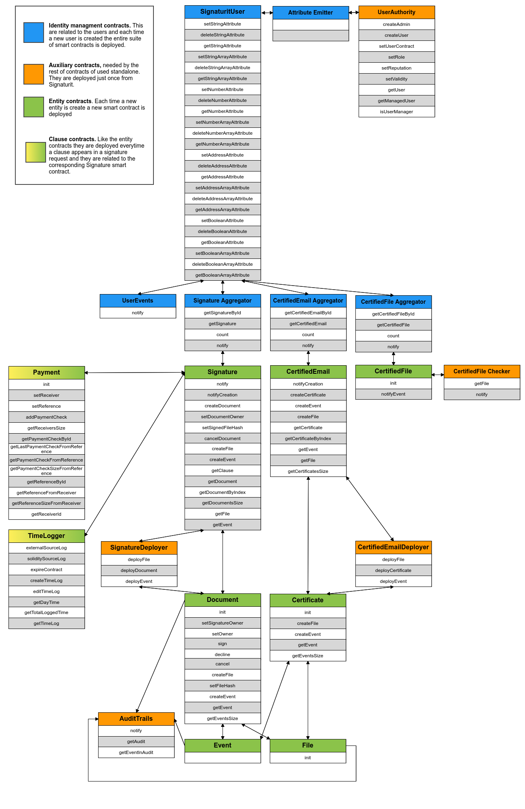

# Blockchain smart contracts

This repository contains all the Signaturit Smart Contracts used by various services. Always rely on this for the latest version of the contracts.

---

## Structure

```
build/
  /contracts         -- This contains all the compiled contracts in forms of json files
contracts/           -- Here there are all the Solidity smart contracts files
  /interfaces        -- Sub-directory that contains only the interfaces of the root contract files
  /libraries         -- Sub-directory for eventual smart contracts to serve as library/utility/tools..
migrations/          -- Scripts for truffle environment
test/                -- This is where all the smart contracts tests are located
```
## Signaturit Core - Smart Contracts

#### _User.sol_

This smart contract is called by all the others and is referenced to each user. Every user interacting with blockchain through our services will have an associated smart contract of this type. It will track and register events coming from:
  - _Signature requests_
  - _Documents_
  - _Files_
  - _Events_
  - _Certified emails_
  - _Certificates_
  - _Certified Files_
  
It will also give some insights and statistics with the getter functions and the possibility to recover one of the above mentioned entities.

Lastly it notifies events occurring on smart clauses firing its own event.

#### _SignatureDeployer.sol_

This smart contract serves as deployer of other smart contracts on blockchain. The purpose is to reduce as much as possible the gas consumption so instead of importing nested contracts in our definitions we developed this smart contract living beforehand on blockchain and serving new incoming smart contracts.

In concrete this is able to deploy the smart contracts related to:
  - _Document_
  - _File_
  - _Event_

The _SignatureDeployer_ address is used as constructor input parameter in the _Signature_ smart contract so it can be called afterhand by the _Signature_ contract itself when needed.

#### _CertifiedEmailDeployer.sol_

As the contract before, this serve for the same purpose of _SignatureDeployer_ but instead of serving a _Signature_ it serves a _CertifiedEmail_.

In concrete this is able to deploy the smart contracts related:
  - _Certificate_
  - _File_
  - _Event_

The _CertifiedEmailDeployer_ address is used as constructor input parameter in the _CertifiedEmail_ smart contract so it can be called afterhand by the _CertifiedEmail_ contract itself when needed.

#### _Signature.sol_

This is one of the most important smart contracts. It represents a signature request on Signaturit platform and brings all the parameters and actions needed to deal with, to set and to retrieve all the related entities (_Document_, _Event_ and _File_ associated). It also makes use of the _SignatureDeployer.sol_ to instantiate all the needed contracts.

To save gas consumptions it imports just the interfaces of the other contracts and it makes use of a library to convert some datatypes to others.

To be protected against malicious attacks, the sensible informations are written by functions restricted in access just to the creator of the smart contract (Signaturit as company) and the creator of the signature request (the owner).

Lastly it registers all the smart clauses related to the signature request and makes them retrievables.

#### _Document.sol_

This contract is related to a signature contract and from it it derives some parameters. 

It brings all the parameters and actions needed to deal with, to set and to retrieve all the related entities (_File_ and _Event_).

To save gas consumptions it imports just the interfaces of the other contracts and it makes use of a library to convert some datatypes to others.

It has an initialization function _init_ to be triggered afterward the execution. This is to deal with asynchronous creations while listening to Signaturit platform events.

Here the owner of the signature can trigger three actions:
  - Sign the document
  - Cancel the document
  - Decline the document

All the other actions are restricted to be executed exclusively by the Signaturit account.

#### _CertifiedEmail.sol_

As the _Signaturit.sol_ smart contract, this is one of the most important smart contracts. It represents a certified email request on Signaturit platform and brings all the parameters and actions needed to deal with, to set and to retrieve all the related entities (_Certificate_, _Event_ and _File_). It also makes use of the _CertifiedEmailDeployer.sol_ to instantiate all the needed contracts.

To save gas consumptions it imports just the interfaces of the other contracts and it makes use of a library to convert some datatypes to others.

To be protected against malicious attacks, the sensible informations are written by functions restricted in access just to the creator of the smart contract (Signaturit as company).

#### _Certificate.sol_

This contract is related to a certified email contract and from it it derives some parameters. 

It brings all the parameters and actions needed to deal with, to set and to retrieve all the related entities (_File_ and _Event_).

To save gas consumptions it imports just the interfaces of the other contracts and it makes use of a library to convert some datatypes to others.

It has an initialization function _init_ to be triggered afterward the execution. This is to deal with asynchronous creations while listening to Signaturit platform events.

#### _File.sol_

This is the smart contract associated to a file. A file can belong both to a _Document_ or a _Certificate_ and thus come from a _Signature_ or a _CertifiedEmail_ request. 

The parent from where it derives is defined as constructor parameter.

It has an initialization function _init_ to be triggered afterward the execution. This is to deal with asynchronous creations while listening to Signaturit platform events.

#### _Event.sol_

This is the smart contract associated to an event. An event can belong both to a _Document_ or a _Certificate_ and thus come from a _Signature_ or a _CertifiedEmail_ request. 

The parent from where it derives is defined as constructor parameter.

## Signaturit Smart Clauses - Smart Contracts

#### _Payment.sol_

This is the smart contract associated to a smart payment clause. Every time a signature request with a payment clauses is generated on the platform both a signature and a payment smart contracts will be deployed on blockchain.

This smart contracts will communicate to the _Signature.sol_ its own address and will notify the _User.sol_ later payment check results.

It gives some insights and statistics on the results of the payment checks.

To save gas consumptions it imports just the interfaces of the other contracts (_Signature_ and _User_).

It has an initialization function _init_ to be triggered afterward the execution. This is to deal with asynchronous creations while listening to Signaturit platform events.

## Setup

Clone the repo and install the dependencies

```
git clone https://github.com/signaturit/signaturit-smart-contracts.git
cd signaturit-smart-contracts
npm install
```

## How to test

Run the command from the root directory

```
npm run test
```

## How to compile and deploy on Blockchain

To compile the smart contracts contained in the contracts/ directory run
```
truffle compile
```

To deploy on Blockchain you first need to define a valid blockchain node on the _truffle-config.js_ file and then run
```
truffle migrate --reset
```

The reset flag is optional and it will replace existing contracts if already deployed.

# Smart Contracts relations


